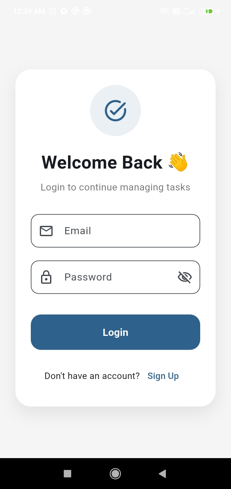
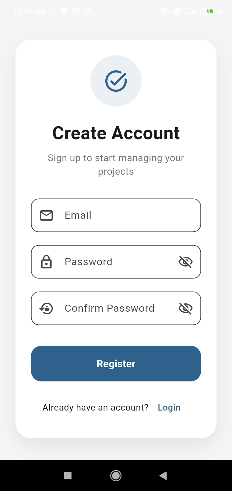
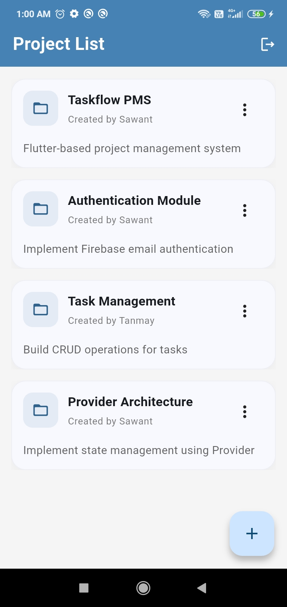
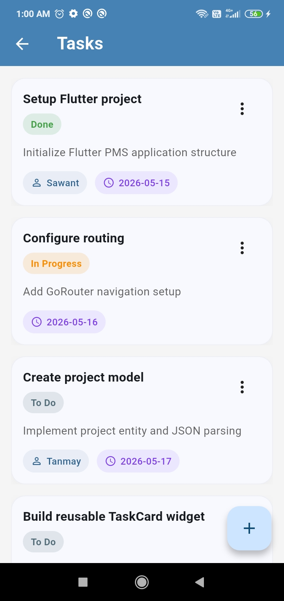
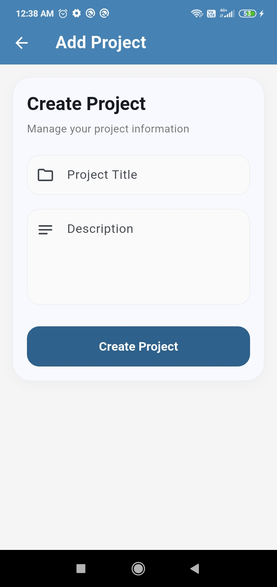
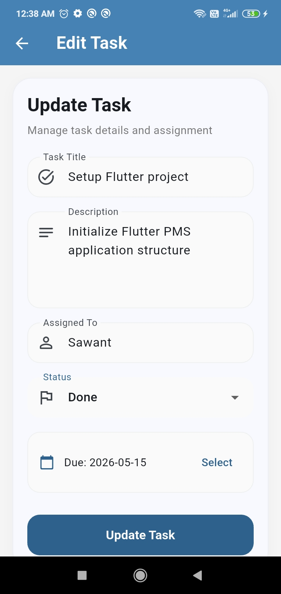

# TaskFlow PMS

TaskFlow PMS is a Flutter-based Project Management System built using Provider state management, Firebase Authentication, and REST API integration.
The application allows users to manage projects and tasks with full CRUD functionality and interactive task status updates.

---

## Features

* Firebase Email/Password Authentication
* Project Management (Create, Read, Update, Delete)
* Task Management (Create, Read, Update, Delete)
* Interactive Task Status Updates
* Provider State Management
* REST API Integration using MockAPI
* Reusable Widgets and Modular Architecture
* Dynamic `createdBy` and `assignedTo` fields
* Modern Material 3 UI

---

## Tech Stack

* Flutter
* Dart
* Provider
* Firebase Authentication
* REST APIs
* MockAPI
* Material 3

---

## Project Structure

```plaintext
lib/
│
├── core/
│   ├── theme/
│   ├── utils/
│
├── models/
│   ├── enums/
│    
├── providers/
│
├── routes/
│
├── screens/
│   ├── auth/
│   ├── project/
│   └── task/
│
├── services/
│
├── widgets/
│
└── main.dart
```

---

## Architecture

The app follows a modular layered architecture:

* **UI Layer** → Screens & Widgets
* **Provider Layer** → State Management
* **Service Layer** → API & Firebase logic
* **Model Layer** → Data Models

---

## API Integration

The application uses MockAPI to simulate RESTful backend services for project and task CRUD operations.

---

## Screens

* Auth Screen (Login / Signup)
* Project List Screen
* Project Form Screen
* Task List Screen
* Task Form Screen

---

## Screenshots

### Login


### Register


### Project List


### Task List


### Project Form


### Task Form


---

## Setup Instructions

### 1. Clone Repository

```bash
git clone <your-repo-link>
```

### 2. Install Dependencies

```bash
flutter pub get
```

### 3. Configure Firebase

Run:

```bash
flutterfire configure
```

Ensure Firebase Authentication is enabled.

---

### 4. Run Application

```bash
flutter run
```

---

## Author

Sawant Singh

Flutter Developer
